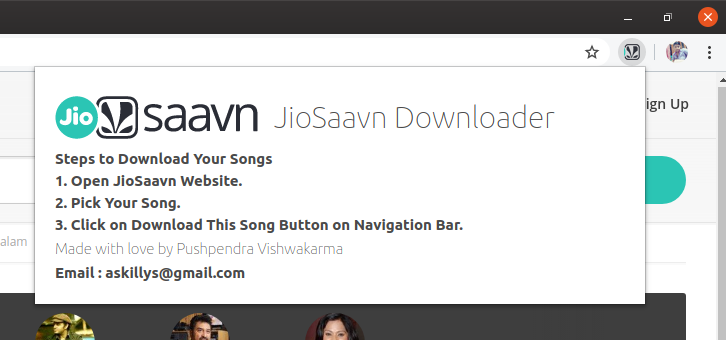
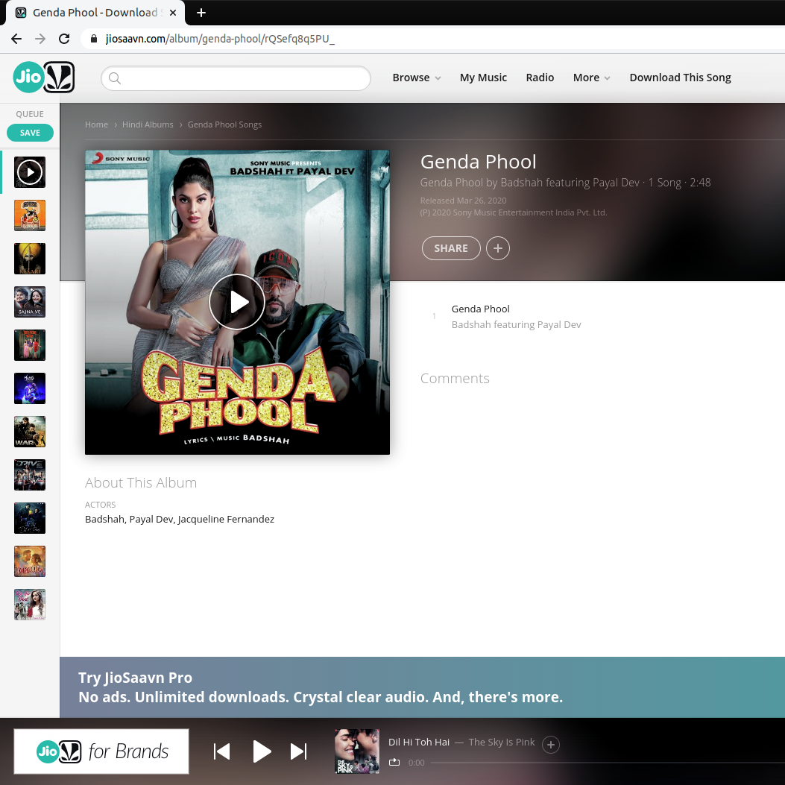
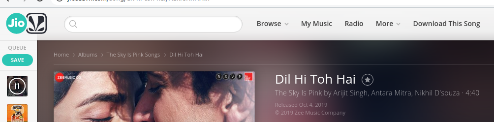

# JioSaavn Downloader
You can use this Extension by Installing by getting copy of this repo and Install it in your Chrome Browser via Developer's Mode, after that, open https://www.jiosaavn.com and pick a song which you would like to Download, and After opening, A Download This Song button will come in Navigation bar which not comes normally, by clicking on that button your Song Downloads in MP3 extension, and you can save it anywhere on local computer.

## Extension Screenshot

## Download Page Screenshot

## Download this Song Button on NavBar
